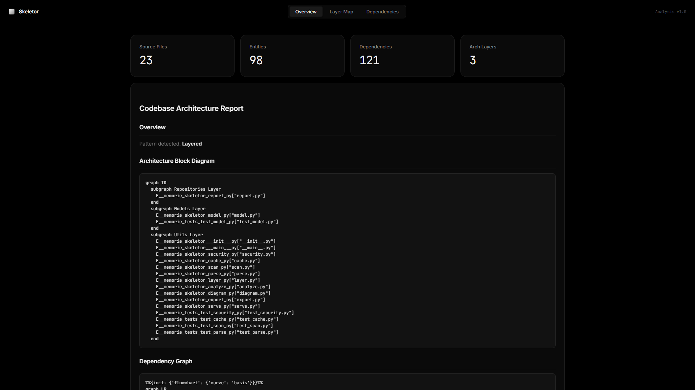
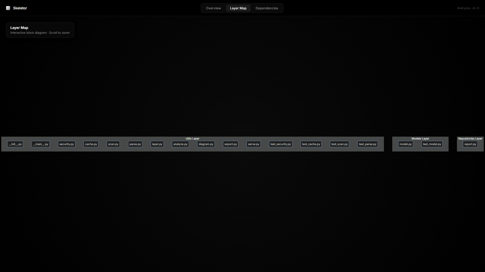
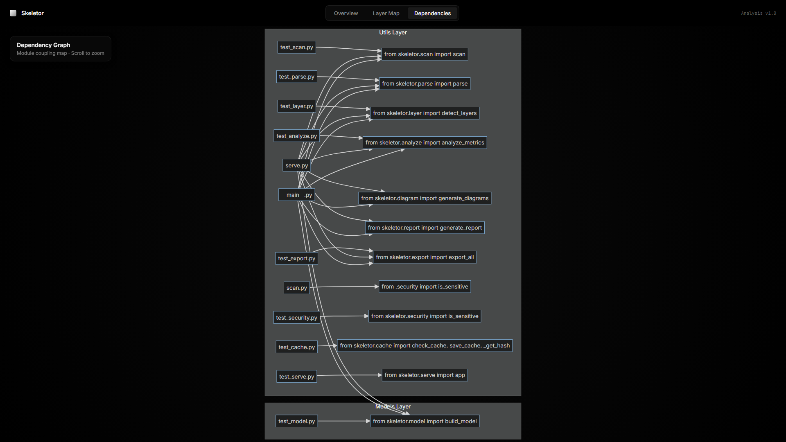

<div align="center">
  <h1>💀 Skeletor</h1>
  <p><strong>A deep codebase understanding and architecture visualization tool.</strong></p>

  [](https://www.python.org/downloads/)
  [](https://opensource.org/licenses/MIT)
  []()
</div>

<br />

<p align="center">
  
</p>

<p align="center">
  
  
</p>

<br />

Stop guessing how your legacy code is connected. **Skeletor** statically analyzes your codebase to automatically generate interactive dashboards, Mermaid architecture diagrams, and code complexity metrics. Built for developers, architects, and AI Agents.

---

## ✨ Why Skeletor?

- 🧠 **Multi-Language AST Parsing**: Powered by `tree-sitter` for 100% accurate extraction of classes, functions, and imports. No more regex-based guessing.
- 🕸️ **Dependency Graphing**: Builds a comprehensive directed graph of your codebase to understand exactly what relies on what.
- 🏗️ **Layer Detection**: Automatically categorizes files into architectural layers (Controllers, Services, Repositories, Models).
- 🩺 **Code Health Metrics**: Identifies **Dead Code**, **Hotspots** (high coupling), and **Circular Dependencies**.
- 🎨 **World-Class Visual Dashboards**: Exports an interactive, Linear-inspired dark-mode HTML dashboard with full-bleed canvas navigation.
- 🤖 **Agent-Native (MCP)**: Connects natively to AI Agents (Claude Code, Antigravity) via the Model Context Protocol.

---

## 🚀 Quick Start

Skeletor is a modern Python package. You can install it globally in seconds using `uv`:

```bash
uv tool install skeletor
```

*(Alternatively, use `pip install skeletor`)*

To analyze a codebase, simply point Skeletor at a directory:

```bash
skeletor /path/to/your/project
```

Skeletor will rapidly scan your project and output a `skeletor-out/` directory containing:
- `dashboard.html`: A beautiful, interactive web UI visualizing the architecture.
- `ARCHITECTURE_REPORT.md`: A comprehensive markdown summary of code health.
- `model.json`: Raw graph node/edge data.
- `*.mmd`: Standalone Mermaid diagram files.

---

## 🤖 AI Agent Integration

Skeletor is designed to be the "eyes" for AI coding agents, providing them with deep architectural context. 

### As an Agent Skill
Skeletor provides a pre-configured Skill profile (`SKILL.md`) allowing agents to run scans autonomously.

**For Claude Code (Project Setup):**
If you commit `.agents/skills/skeletor/SKILL.md` to your repository, Claude Code will automatically discover it.

**For Antigravity (Global Setup):**
```bash
# Windows
mkdir -p %USERPROFILE%\.gemini\config\skills\skeletor
copy .agents\skills\skeletor\SKILL.md %USERPROFILE%\.gemini\config\skills\skeletor\

# macOS/Linux
mkdir -p ~/.gemini/config/skills/skeletor
cp .agents/skills/skeletor/SKILL.md ~/.gemini/config/skills/skeletor/
```

### Model Context Protocol (MCP)
Hook Skeletor into any MCP-compatible client:
```json
{
  "mcpServers": {
    "skeletor": {
      "command": "python",
      "args": ["-c", "import skeletor.serve; skeletor.serve.start_server()"]
    }
  }
}
```

---

## ⚙️ How it Works (The 8-Stage Pipeline)

Skeletor uses a highly optimized 8-stage pipeline to convert raw code into visual intelligence:

| Stage | Description |
| :--- | :--- |
| **1. Scan** | Smartly discovers files while ignoring `.gitignore` and `.env` secrets. |
| **2. Parse** | Uses multi-language ASTs to extract structural tokens. |
| **3. Model** | Links tokens into a unified Directed Graph (DiGraph). |
| **4. Layer** | Heuristically detects MVC / Layered architecture boundaries. |
| **5. Analyze** | Computes coupling, cohesion, and dead code metrics. |
| **6. Diagram** | Generates structural Mermaid.js visualizations. |
| **7. Report** | Synthesizes a Markdown audit. |
| **8. Export** | Renders the HTML Dashboard. |

---

## 🤝 Contributing

Contributions, issues, and feature requests are welcome! Feel free to check the [issues page](https://github.com/yourusername/skeletor/issues).

## 📝 License

This project is [MIT](LICENSE) licensed.
